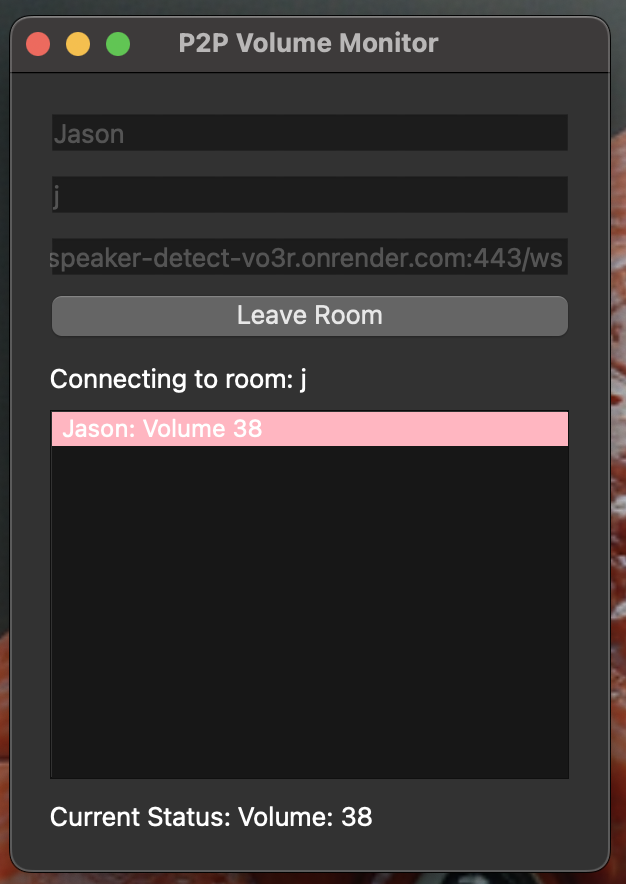

# P2P Volume Monitor



P2P Volume Monitor is a Python application that allows users to join virtual rooms and monitor each other's system volume levels in real-time. It's designed to help groups ensure that everyone's speakers are muted or at an appropriate volume level during online meetings or collaborative sessions.

## Features

- Join and leave virtual rooms
- Real-time monitoring of participants' volume levels
- Visual indicators for muted and unmuted states
- Automatic detection of system volume changes
- Cross-client synchronization of volume states
- Support for both Windows and macOS

## Requirements

- Python 3.7+
- PyQt6
- pycaw (for Windows)

## Installation

1. Clone the repository:

   ```
   git clone https://github.com/stillerman/speaker-detect
   cd speaker-detect
   ```

2. Install the required dependencies:
   ```
   pip install -r requirements.txt
   ```

## Usage

1. Start the server:

   ```
   yarn install
   yarn start
   ```

2. Run the client application (can be run multiple times for multiple clients):

   ```
   python p2p_volume_monitor.py
   ```

3. Enter your name and a room name, the uri of the server and then click "Join Room".

4. The application will display the volume status of all participants in the room. Green indicates muted or zero volume, while red indicates unmuted with volume above zero.

5. To leave the room, click the "Leave Room" button.

## Deployment

- Client builds for Windows are automatically created and uploaded to github. This is done with the github actions workflow in `.github/workflows/build.yml`.
- The server is deployed on render.com.
